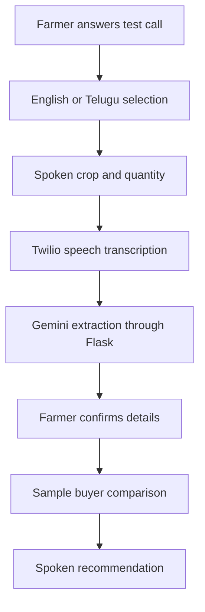

# 🌾 Fasal Mitra
### Speak your harvest. Hear your options.

**An English–Telugu AI voice assistant designed for farmers with basic phones.**

Fasal Mitra lets farmers describe their harvest through a regular phone call, confirm the recognized details, and hear a sample buyer recommendation—without installing an app or typing.

> **Project status:** Working student hackathon prototype. Phone calls and AI extraction are functional; buyer listings, prices, and transport costs are fictional demonstration data.

## 💡 The Idea

Agricultural technology should also be accessible to farmers who have limited access to smartphones or are less comfortable using apps.

Fasal Mitra explores a simple alternative: **a conversation over the phone, in a familiar language.**

The farmer needs cellular voice coverage, but no smartphone or mobile data. The backend needs an internet connection.

## ✨ Features

- **Real phone calls** to consenting, allowlisted test recipients.
- **Bilingual interaction:** press **1 for English** or **2 for Telugu**.
- **Natural speech input:** describe the crop and quantity in your own words.
- **AI-powered extraction:** identifies crop and quantity from the speech transcript.
- **Spoken confirmation:** checks the recognized details before proceeding.
- **Sample buyer matching:** compares estimated returns after assumed transport costs.
- **Voice responses** in the selected language.
- **Optional SMS support**, requiring configuration and explicit recipient consent.

## 📞 How It Works

1. A developer initiates a test call to a verified, consenting recipient.
2. The farmer selects English or Telugu.
3. The farmer speaks the crop name and quantity.
4. Twilio transcribes the speech.
5. Gemini extracts structured harvest details.
6. The farmer confirms the recognized information.
7. The application compares eligible sample buyers.
8. The farmer hears the recommendation and estimated amount.

**Example input:**

> “I have twenty kilograms of rice.”

**Telugu example:**

> “నా దగ్గర ఇరవై కిలోల బియ్యం ఉన్నాయి.”

The keypad selects the language. **The harvest details are spoken naturally.**

## 🧠 Where AI Is Used

Gemini interprets the speech transcript and extracts the crop and quantity.

Buyer ranking uses a separate, transparent calculation:

```text
Estimated amount = quantity × sample price − assumed transport cost
```

This keeps the recommendation explainable and prevents the AI from inventing buyer prices.

### Example: 20 kg of rice

| Fictional buyer | Price per kg | Assumed transport | Estimated amount |
|---|---:|---:|---:|
| Demo Local Buyer | ₹30 | ₹0 | **₹600** |
| Demo Wholesale Buyer | ₹32 | ₹100 | ₹540 |

The local buyer is selected in this example because the estimated amount after transport is higher.

**These are sample figures, not live market prices, guaranteed earnings, or a booking.**

## 🌱 Supported Demo Crops

Rice · Paddy · Tomato · Onion · Maize · Wheat · Spinach

Rice and paddy are treated as separate crops.

## 🛠️ Technology Stack

| Technology | Role |
|---|---|
| Python | Application logic |
| Flask | Voice webhook backend |
| Twilio | Calls, keypad input, speech recognition, speech playback, optional SMS |
| Google Gemini API | Harvest detail extraction |
| SQLite | Local call state |
| ngrok | Public HTTPS tunnel to the local server |
| python-dotenv | Local configuration |

## 🏗️ Architecture



## 📁 Main Files

| File | Purpose |
|---|---|
| `bilingual_server.py` | English–Telugu call flow |
| `bilingual_common.py` | Bilingual utilities and state handling |
| `bilingual_call.py` | Initiates one test call |
| `bilingual_status.py` | Checks call status |
| `demo_common.py` | Shared demo configuration and utilities |
| `demo_setup.py` | Interactive configuration |
| `demo_ai_test.py` | Tests AI extraction separately |
| `demo_requirements.txt` | Dependencies for the demo |
| `test_bilingual.py` | Offline bilingual tests |
| `BILINGUAL_START.md` | Additional bilingual setup guidance |

The repository also includes earlier prototype files. For the current bilingual demo, use **`bilingual_server.py` and `bilingual_call.py`**.

## 🚀 Run Locally

### Prerequisites

- Python; the prototype was developed using Python 3.13.
- A Twilio account, voice-capable number, and eligible verified test recipient.
- A Gemini API key with access to the configured model.
- ngrok installed and authenticated.
- Internet access for the backend.

Provider trial allowances and API quotas apply. This project does not provide unlimited free calls or API usage.

### 1. Clone the repository

```powershell
git clone https://github.com/sahanachowdary/Fasal-Mitra.git
cd Fasal-Mitra
```

### 2. Create an environment and install dependencies

```powershell
py -m venv .venv
.\.venv\Scripts\python.exe -m pip install -r demo_requirements.txt
```

### 3. Start ngrok

In a separate terminal:

```powershell
ngrok http 5000
```

Keep it running. Copy the HTTPS forwarding domain for the next step.

### 4. Configure the demo

```powershell
.\.venv\Scripts\python.exe demo_setup.py
```

Provide your own credentials when prompted:

| Setting | Description |
|---|---|
| `TWILIO_ACCOUNT_SID` | Your Twilio account SID |
| `TWILIO_AUTH_TOKEN` | Your private Twilio auth token |
| `TWILIO_VOICE_FROM` | Your Twilio voice number |
| `ALLOWED_TEST_NUMBERS` | Consenting, verified recipient numbers |
| `PUBLIC_BASE_URL` | Your ngrok HTTPS domain, without a route |
| `GEMINI_API_KEY` | Your private Gemini API key |
| `GEMINI_MODEL` | A model available to your project |

Settings are saved locally in `.demo.env`.

The working demo used `gemini-3.5-flash-lite`. If setup saves an older default, update `GEMINI_MODEL` in `.demo.env` to a model available to your account.

Keep `DEMO_SMS_ENABLED=0` for the initial voice test.

### 5. Test AI extraction

```powershell
.\.venv\Scripts\python.exe demo_ai_test.py
```

This makes a real API request and uses provider quota.

### 6. Start the bilingual server

```powershell
.\.venv\Scripts\python.exe bilingual_server.py
```

Keep this terminal running alongside ngrok.

Local health endpoint:

```text
http://127.0.0.1:5000/health
```

Run only one application server on port 5000.

### 7. Make a test call

In another terminal:

```powershell
.\.venv\Scripts\python.exe bilingual_call.py --consent-confirmed
```

This places a real call to the configured test recipient. Use it only with their consent.

Answer the call, select a language, and speak the crop and quantity.

### 8. Check status

```powershell
.\.venv\Scripts\python.exe bilingual_status.py
```

## 🧪 Testing

Run the offline tests:

```powershell
.\.venv\Scripts\python.exe -m unittest test_bilingual -v
```

The bilingual suite contains **22 offline tests with mocked provider requests**. English and Telugu call flows were also manually tested during prototype development.

These tests are not a field accuracy study. Integrated SMS delivery requires separate validation.

## 🔧 Troubleshooting

| Problem | What to check |
|---|---|
| Server unreachable | Keep Flask and ngrok running; verify the configured public domain. |
| Wrong server detected | Use `bilingual_server.py` with `bilingual_call.py`. |
| API key rejected | Verify your key privately and update local configuration. |
| Model unavailable | Select a model accessible to your project. |
| Quota exhausted | Check your provider's remaining quota. |
| Incorrect crop or quantity | Reject the readback and retry with a clear, short sentence. |
| Unknown call outcome | Check status and provider logs before requesting another call. |

Restart the application server after changing configuration.

## 🔐 Privacy

- Credentials stay in local configuration files.
- Never commit `.env`, `.demo.env`, call databases, or API keys.
- Never share callback URLs containing authentication tokens.
- Use fictional harvest details for demonstrations.
- Call only consenting test recipients.
- The current authentication and deployment setup are intended for a controlled prototype and need further review before production use.

## 📍 Current Scope

**Implemented:** bilingual outbound calls, natural speech input, AI extraction, spoken confirmation, and sample buyer recommendations.

**Not yet connected:** live market prices, verified buyer inventory, actual bookings, payments, cold-storage availability, and inbound or missed-call access.

## 🔮 Future Improvements

- Connect verified buyers and current market data.
- Add inbound calls and missed-call callbacks.
- Expand regional-language support.
- Test with farmer groups across accents and noisy environments.
- Validate SMS delivery across supported destinations.
- Introduce storage and transport options.
- Improve deployment reliability and operating-cost controls.

## 👩‍💻 Team Cold Jugaad

- P. Sahana Chowdari
- P. Shri Harshitha
- N. Hasini

---

**Making agricultural assistance accessible through a familiar interface—a phone call.**
